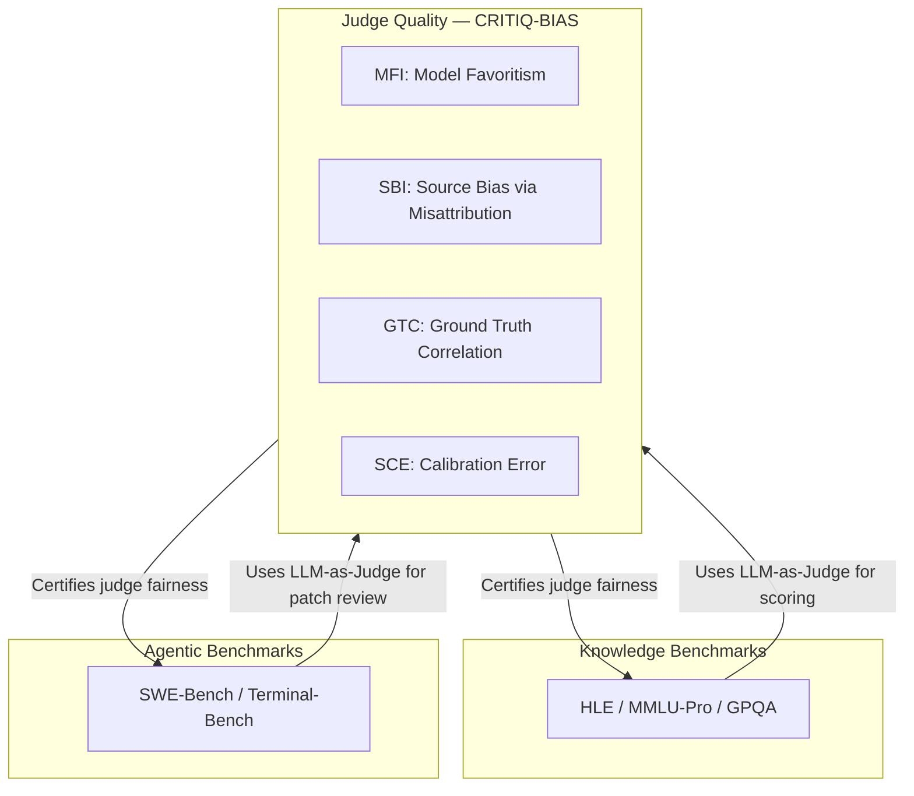

# CRITIQ-BIAS SOTA Benchmark Roadmap

> Positioning CRITIQ-BIAS as the leading benchmark for **LLM-as-Judge critique bias** — the evaluation layer that every other benchmark depends on.

## Executive Summary

The 2024–2026 wave of LLM benchmarks reveals a clear pattern: **saturated benchmarks die fast** (MMLU, HumanEval), while **frontier benchmarks** emphasize expert curation, anti-contamination, statistical rigor, and multi-dimensional evaluation. CRITIQ-BIAS occupies a unique niche — it does not test *what models know*, but *how fairly models judge each other*. As LLM-as-Judge becomes the dominant evaluation paradigm (MT-Bench, Chatbot Arena, AlpacaEval, SWE-Bench scoring), measuring judge bias is increasingly critical.

This roadmap maps the new benchmark landscape onto concrete CRITIQ-BIAS upgrades.

---

## Part 1: Landscape Scan — The New Wave of LLM Benchmarks

### Tier 1: Frontier Knowledge & Reasoning (Saturated for Top Models)

| Benchmark | Focus | Key Innovation | Saturation Status |
|-----------|-------|----------------|-------------------|
| **Humanity's Last Exam (HLE)** | Expert-level academic Q&A across 100+ disciplines | 2,500 expert-vetted, Google-proof questions; confidence calibration | Active differentiator (~25% SOTA) |
| **MMLU-Pro** | Graduate-level multi-task understanding | 12K questions, 10 answer choices, chain-of-thought required | Partially saturated |
| **GPQA Diamond** | PhD-level science Q&A | 198 hardest questions; experts 65%, non-experts 34% | Active |
| **ARC-AGI-2** | Abstract reasoning | Resists memorization; tests generalization | Active |

**Lesson for CRITIQ-BIAS:** Frontier benchmarks use *expert curation*, *anti-retrieval design*, and *calibration metrics*. We adopt ground-truth correlation and calibration error.

### Tier 2: Agentic & Tool-Use Evaluation (Fastest Growing)

| Benchmark | Focus | Key Innovation |
|-----------|-------|----------------|
| **SWE-Bench Verified** | Real GitHub issue resolution | Human-validated, execution-based verification |
| **Terminal-Bench 2.0** | CLI agent tasks | 89 expert-written, sandboxed, economically valuable tasks |
| **LoCoBench-Agent** | Long-context software engineering | 8K multi-turn scenarios, 10K–1M token contexts |
| **τ-Bench / BFCL** | Tool calling & API use | Function-calling accuracy, multi-step reliability |
| **OSWorld / WebArena** | Computer use agents | Real environment interaction |

**Lesson for CRITIQ-BIAS:** Agentic benchmarks test *process fidelity*, not just outputs. We add **agentic prompt categories** (tool-use instructions, multi-step workflows) to our stimulus datasets.

### Tier 3: LLM-as-Judge & Preference Evaluation (Our Direct Niche)

| Benchmark / Study | Focus | Key Finding |
|-------------------|-------|-------------|
| **MT-Bench / Chatbot Arena** | Multi-turn preference | Position bias, verbosity bias documented |
| **LLMBar** | Instruction-following judgment | Judges fail on subtle instruction violations |
| **CALM Framework** | Bias quantification via perturbation | 12+ bias types; robustness rate metric |
| **Scoring Bias (2025)** | Rubric order, score ID, reference answer bias | Scoring stability disrupted by prompt perturbations |
| **Judging the Judges (2026)** | 9 debiasing strategies × 5 models | Style bias (0.76–0.92) dominates position bias (≤0.04) |

**Lesson for CRITIQ-BIAS:** We are already in this tier. To reach SOTA we must:
1. Cover all major bias dimensions (source, style, verbosity, position, scoring rubric)
2. Provide controlled perturbation experiments (factorial design)
3. Report effect sizes with confidence intervals
4. Validate against human ground truth

### Tier 4: Safety, Factuality & Robustness

| Benchmark | Focus |
|-----------|-------|
| **HELM Safety / AIR-Bench** | Harmful output detection |
| **FACTS / FActScore** | Factual accuracy of long-form generation |
| **HarmBench** | Red-teaming resistance |

**Lesson for CRITIQ-BIAS:** Add safety-relevant prompt categories and test whether critics are harsher/lenient on adversarial or jailbreak-style prompts.

---

## Part 2: CRITIQ-BIAS Competitive Positioning

### What Makes a SOTA Benchmark (2025–2026 Criteria)

1. **Expert-curated stimuli** with known ground truth — not model-generated noise
2. **Factorial experimental design** with controlled perturbations
3. **Statistical rigor** — bootstrap CIs, effect sizes, ANOVA, replications
4. **Multi-dimensional metrics** beyond a single score
5. **Calibration validation** — do judges know what they don't know?
6. **Anti-gaming design** — resistance to prompt injection in judge prompts
7. **Reproducibility** — seeds, caching, versioned configs, public artifacts
8. **Leaderboard** — aggregated, comparable results across models and runs
9. **Domain coverage** — coding, reasoning, creative, agentic, safety, meta
10. **Modern model coverage** — frontier models from all major providers

### CRITIQ-BIAS Unique Value Proposition

> **CRITIQ-BIAS is the only benchmark that systematically measures whether LLM judges are fair when they know (or are misled about) who created the content they evaluate.**

No other benchmark isolates **source attribution bias** via misattribution factorial design. This is our moat.

---

## Part 3: Implemented Upgrades (v2.1)

### Bug Fixes
- [x] BPS metric now handles both `visible`/`blind` and legacy `source_visible`/`source_blind` condition names
- [x] V2 critique fields (`visibility_condition`, `claimed_source`, `replication_id`, `seed_used`) now persisted
- [x] V2 prompt metadata (`source_type`, `dataset_name`, `prompt_category`, `ground_truth_score`) now populated

### New Metrics

| Metric | Name | Description | SOTA Inspiration |
|--------|------|-------------|------------------|
| **GTC** | Ground Truth Correlation | Pearson r between critic scores and human ground-truth ratings | HLE calibration, scoring bias papers |
| **SCE** | Scoring Calibration Error | Mean absolute error vs. human ground truth | Confidence calibration (HLE) |
| **SBI** | Source Bias Index | Score shift under misattribution vs. blind condition | CALM perturbation framework |
| **ANOVA** | Condition Effect Analysis | One-way ANOVA across visibility conditions per critic | Standard experimental rigor |

### Expanded Dataset: `sota_prompts`

40 curated prompts across 8 categories aligned with 2025–2026 benchmark axes:

| Category | Count | Benchmark Alignment |
|----------|-------|---------------------|
| coding | 6 | SWE-Bench, HumanEval |
| reasoning | 6 | HLE, GPQA |
| agentic | 5 | Terminal-Bench, LoCoBench |
| creative | 5 | General generation quality |
| analysis | 5 | Business/technical analysis |
| instruction | 5 | System prompt design |
| safety | 4 | HELM Safety, HarmBench |
| meta | 4 | Prompt engineering critique |

Each prompt includes human `ground_truth_score` (0–10) for calibration validation.

### New Experiment: `v8_sota_factorial.yaml`

Full v2.0 factorial design with:
- `sota_prompts` dataset (30 prompts sampled)
- Modern frontier critics (GPT-4o, Claude 3.5 Sonnet, Gemini 2.0 Flash)
- 3 visibility conditions + 4 misattribution levels
- 5 replications with distinct seeds
- All statistical outputs enabled

### Leaderboard Aggregator

`scripts/leaderboard.py` — aggregates metrics across all completed runs into a ranked leaderboard CSV/JSON.

---

## Part 4: Future Roadmap (v3.0)

### Phase 1: Bias Dimension Expansion (Q2 2026)

| Bias Type | Test Design | Reference |
|-----------|-------------|-----------|
| **Verbosity bias** | Same content, short vs. padded versions | Judging the Judges |
| **Position bias** | Pairwise A/B with order swapping | CALM, MT-Bench |
| **Style bias** | Same content, markdown vs. plain vs. bullet | Judging the Judges (0.76–0.92 severity) |
| **Rubric order bias** | Descending vs. ascending quality anchors | Scoring Bias (2025) |
| **Self-preference** | Critic evaluates own output vs. identical competitor output | LLM-as-Judge survey |

### Phase 2: Scale & Coverage (Q3 2026)

- [ ] Expand to 200+ curated prompts with inter-rater reliability scores
- [ ] Human critic baseline (crowdsourced annotations for calibration)
- [ ] Multi-judge ensemble scoring (reduce variance)
- [ ] Pairwise comparison mode (A/B preference, not just scalar scoring)
- [ ] Cross-lingual prompt categories (multilingual judge bias)

### Phase 3: Integration & Ecosystem (Q4 2026)

- [ ] HuggingFace dataset card and leaderboard integration
- [ ] Open benchmark submission API (community-contributed prompts)
- [ ] Integration hooks for LangSmith, Arize Phoenix, Braintrust eval platforms
- [ ] Automated judge certification pipeline ("is your judge biased?")
- [ ] Adversarial robustness tests (judge prompt injection resistance)

### Phase 4: Research Extensions

- [ ] **CRITIQ-BIAS-Agent**: Do agentic critics (with tool access) show different bias patterns?
- [ ] **CRITIQ-BIAS-Multimodal**: Image/chart prompt critique with source attribution
- [ ] **CRITIQ-BIAS-Debias**: Benchmark debiasing strategies (from Judging the Judges paper)
- [ ] **CRITIQ-BIAS-Long**: Long-context prompt evaluation (inspired by LoCoBench)

---

## Part 5: How CRITIQ-BIAS Complements Other Benchmarks

Every major benchmark ultimately relies on some form of automated evaluation. CRITIQ-BIAS answers the meta-question: **can we trust the judges?**

---

## References

1. Rein et al. (2024). Humanity's Last Exam. *Nature*.
2. Wang et al. (2024). MMLU-Pro. *NeurIPS*.
3. Rein et al. (2024). GPQA. *COLM*.
4. Ye et al. (2024). CALM: Bias Quantification Framework.
5. Shi et al. (2025). Evaluating Scoring Bias in LLM-as-a-Judge.
6. (2026). Judging the Judges: Systematic Evaluation of Bias Mitigation Strategies.
7. Jimenez et al. (2024). SWE-Bench. *ICLR*.
8. Terminal-Bench 2.0 (2026). tbench.ai.
9. Qiu et al. (2025). LoCoBench-Agent. Salesforce AI Research.
10. Zheng et al. (2023). MT-Bench / Chatbot Arena.
